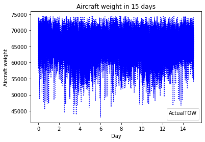
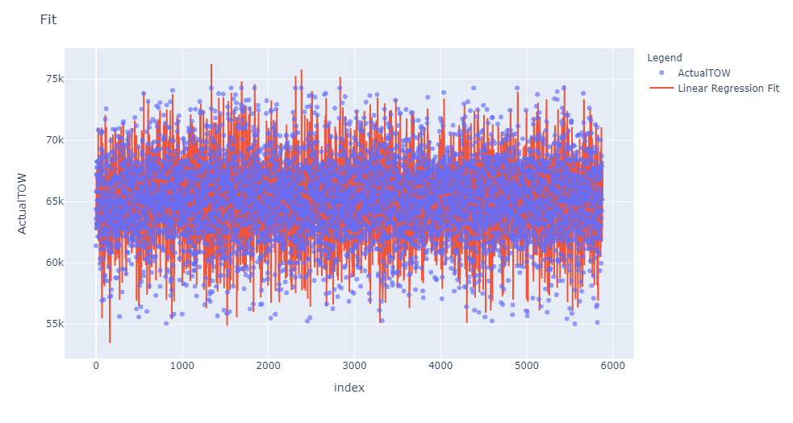

# Weight-Aircraft-Forecasting

### Introduction

The main purpose of this repository is to forecast the weight that one aircraft would have at the Take-Off. In addition, the methodology used is going to be as simpler as possible due to the fact that the main idea could be running this code on a streaming data in a Big Data Plataform. Thus, an easy data dealing could minimize cost to the company besides meeting the requirements of the job.

### Data source

The dataset used was collected from the measures of a flying company has done in order to study the problem above exposed. It implies that it is a real problem and for this reason I am not going to upload the data here.

### Data description

This dataset contains 29731 rows and 14 columns. Each variable represents one information that the company can extract when one user decides to carry out a flight or when you decide to buy a ticket. The variables measured are the following:

- **DepartureDate:** Date of the flight

- **DepartureYear:** Year of the flight

- **DepartureMonth:** Month of the flight

- **DepartureDay:** Day of the flight

- **FlightNumber:** Flight's ID

- **DepartureAirport:** Place where you start your journey

- **ArrivalAirport:** Place where you finish your journey

- **Route:** Mix of both above variables

- **ActualFlightTime:** Flight time in minutes

- **ActualTotalFuel:** Fuel used in the route

- **ActualTOW:** Take-Off Weight, Take off weight of the aircraft in kg

- **FLownPasengers:** Number of passengers on board the aircraft

- **BagsCount:** Number of checked in bags

- **FlightBagsWeight:** Baggage weight in kg

### Problem goals

The goal of the project is to predict the variable "ActualTOW". The data contains the fight measures in 15 days long. the feature has the following distribution through the time:

### Conclusion

3 different learning regressors (Linear Regression, Decission Tree Regression and SGD Regression) were tested, and I have achieved the best prediction performance using Linear Regression, followed by SGD Regression, while Decission Tree Regression achieved the worst performance of the three.

The best prediction performance resulted in the following metrics:

- R-squared Score (R2_Score): **0.8804**

- Root mean squared error (RMSE): **0.3458**

The results can be checked in the following graphic:

